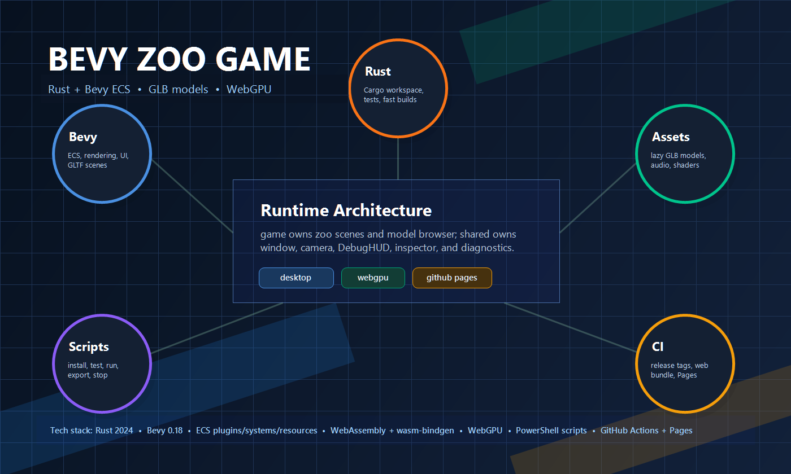
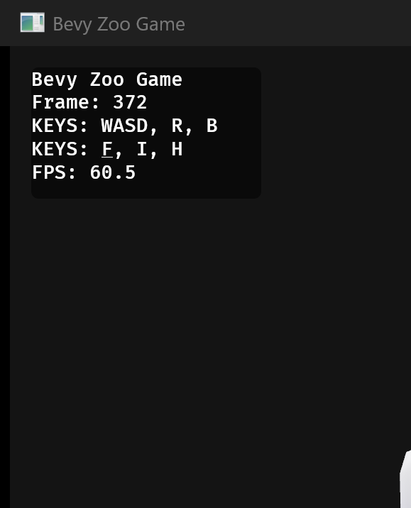

# Bevy Zoo Game

A Bevy ECS zoo game project built from the Codex Project Template.

## Getting Started

| Task | Command |
| ---- | ------- |
| Install dependencies once | `scripts/main/InstallDependencies.ps1` |
| Run tests | `scripts/other/RunTests.ps1` |
| Run desktop | `scripts/other/RunAppDesktop.ps1` |
| Run desktop hot reload | `scripts/main/RunAppDesktopHotReload.ps1` |
| Check desktop | `scripts/other/RunAppDesktop.ps1 -CheckOnly` |
| Run web | `scripts/other/RunAppWeb.ps1` |
| Check web | `scripts/other/RunAppWeb.ps1 -CheckOnly` |
| Stop app | `scripts/other/StopApp.ps1` |

## Requirements

| Requirement | Purpose |
| ----------- | ------- |
| Windows package manager | `InstallDependencies.ps1` can install rustup through `winget` when Rust is not already installed. If `winget` is unavailable, install rustup manually from <https://rustup.rs/>. |
| Rust toolchain | `InstallDependencies.ps1` installs and verifies the `stable` Rust toolchain. |
| Rust target | `InstallDependencies.ps1` installs and verifies `x86_64-pc-windows-msvc`. |
| Cargo | `InstallDependencies.ps1` verifies `cargo` is available after rustup setup. If it is not found, restart the terminal and rerun the script. |
| Dioxus CLI | `InstallDependencies.ps1` verifies or installs Dioxus CLI 0.7.x for desktop hot reload. Pass `-SkipHotReloadTools` to skip this optional setup. |
| MSVC linker | Desktop builds may require `link.exe`. Install Build Tools for Visual Studio from <https://visualstudio.microsoft.com/visual-cpp-build-tools/> with the `Desktop development with C++` workload. |
| Fast linker | `rust-lld` is optional. When available, the scripts use it for faster desktop linking; otherwise they fall back to the default Windows linker. |

## Build Speed

| Setting | Behavior |
| ------- | -------- |
| Desktop target | `scripts/other/RunAppDesktop.ps1` uses the host target with a dedicated `target/run-app-desktop` cache so other Cargo tasks do not invalidate warm runs. |
| First checkout | `scripts/main/InstallDependencies.ps1` warms the same desktop cache once, so later `RunAppDesktop.ps1` calls only rebuild changed code. |
| Default run | `scripts/other/RunAppDesktop.ps1` compiles only changed artifacts, then opens the cached desktop executable. |
| Headless compile helper | `scripts/other/CompileApp.ps1` centralizes Cargo build, check, and test setup for the main run scripts. |
| Fast validation | `scripts/other/RunAppDesktop.ps1 -CheckOnly` runs `cargo check -p bevy-zoo-game --features fast-dev` without launching the app. |
| Fast dev feature | Non-release desktop runs enable `fast-dev`, which turns on Bevy dynamic linking for faster edit-run cycles after the first build. |
| Desktop hot reload | `scripts/main/RunAppDesktopHotReload.ps1` uses Dioxus CLI hot patching with `target/run-app-desktop-hot-reload` and keeps output in the terminal. |
| Web target | `scripts/other/RunAppWeb.ps1` builds `wasm32-unknown-unknown` into `target/run-app-web`, runs `wasm-bindgen`, serves the generated page on localhost, and opens the browser. |
| Explicit target | Pass `-TargetTriple x86_64-pc-windows-msvc` only when a separate target cache is required. |

## Structure

| Path | Purpose |
| ---- | ------- |
| `bevy/crates/game` | Main Bevy game crate and executable for card-specific runtime behavior. |
| `bevy/crates/game/src/runtime/components` | Card-specific ECS data attached to entities. |
| `bevy/crates/game/src/runtime/resources` | Card-specific ECS resources and inspection state. |
| `bevy/crates/game/src/runtime/systems` | Card-specific setup, pointer mapping, smoothing, and DebugHUD composition. |
| `bevy/crates/game/src/runtime/plugins` | Game plugin composition and card POC tests. |
| `bevy/crates/game/assets` | Runtime game assets, including cards, audio, and shaders. |
| `bevy/crates/shared` | Reusable system-level Rust logic for shared runtime behavior. |
| `bevy/crates/shared/src/window.rs` | Project-approved desktop window defaults: 1024x768. |
| `.codex` | Repo-local Codex guidance, skills, memory, and rules. |
| `.specify` | Specify workflow configuration and constitution. |
| `specs` | Active project specs. |
| `scripts` | Repeatable local commands. |
| `documentation/images` | README-visible supporting images. |

## Stack

| Area | Choice |
| ---- | ------ |
| Language | Rust |
| Engine | Bevy |
| Architecture | Shared runtime crate plus game-specific ECS components, resources, systems, and plugins |
| Workspace | Cargo workspace rooted at this repository |

## Development Notes

Keep gameplay changes small and spec-driven. Reusable window, camera, DebugHUD, inspector, and diagnostic input behavior belongs in `bevy/crates/shared`; card-specific geometry, pointer mapping, smoothing, and gameplay behavior belongs in `bevy/crates/game`.

## Asset Loading

| Rule | Behavior |
| ---- | -------- |
| Default policy | Load assets lazily and asynchronously by default. Do not block startup, scene switches, or user-visible interaction while an asset or model loads unless the behavior technically requires the asset before continuing. |
| Preloaders | Do not add preloaders, loading menus, or loading overlays for assets that can pop in after their scene is already usable. |
| GameScene models | Spawn Bevy scene handles for models immediately and let the engine load them asynchronously; the GameScene does not wait for model readiness before becoming active. |
| Model Browser | Request model loads in grid order starting at the upper-left cell. Each request is asynchronous, so models may appear one by one in whatever completion order the asset system produces. |

## Credits

Created by Samuel Asher Rivello.

## License

Provided as-is under [MIT License](./LICENSE).
